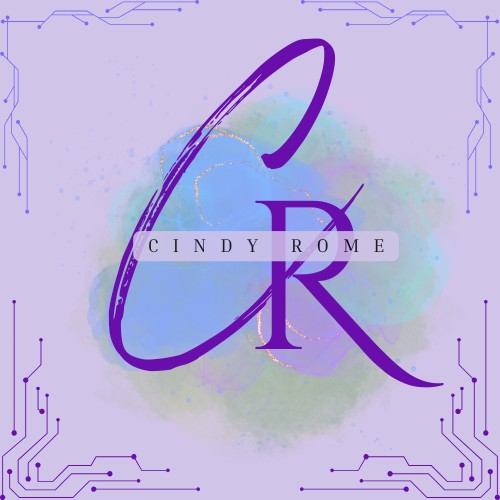

# Portfolio-Rome-C


# Mon Application - Portfolio de Développeur Web

## Description
Cette application est un portfolio en ligne destiné à présenter mes projets. L'objectif est de fournir un espace interactif et professionnel où les visiteurs peuvent découvrir les réalisations, en savoir plus sur l'expertise du développeur, et entrer en contact directement via un formulaire de contact.

### Fonctionnalités principales :
- **Page de présentation de projets** : Visualisez les projets réalisés avec des images et vidéos.
- **Formulaire de contact** : Permet aux utilisateurs de poser des questions ou de demander des informations supplémentaires.
- **Section "À propos de moi"** : Une présentation personnelle du développeur avec ses compétences et expériences.
- **Design responsive** : Optimisé pour une utilisation sur mobile et desktop.
- **Animation fluide** : Animation moderne sur la page d'accueil et les sections.

## Technologies utilisées

Ce projet a été développé en utilisant les technologies suivantes :
- **HTML5** : Structure du site web.
- **CSS3** (avec Flexbox et Grid) : Mise en page et styles modernes.
- **JavaScript** : Pour l'interactivité et les animations.
- **Node.js**
- **Vidéos et images optimisées** : Utilisation de vidéos de fond et d'images haute qualité.

## Prérequis

Avant de commencer, assurez-vous d'avoir installé les éléments suivants :

- Un éditeur de texte comme **VSCode**, **Sublime Text** ou **Atom**.
- **Node.js** (si vous utilisez Node.js pour la gestion des scripts).
- Un serveur local comme **XAMPP** ou **MAMP** si vous utilisez **PHP**.
- Un navigateur moderne pour tester et visualiser l'application (Chrome, Firefox, Edge).

## Installation

### 1. Cloner le repository
Commencez par cloner ce repository sur votre machine locale. Ouvrez votre terminal et tapez la commande suivante :
```bash
git clone https://github.com/ton-utilisateur/ton-portfolio.git

### 2. Installation des dépendances (si vous utilisez Node.js)

Si le projet utilise Node.js pour les dépendances (par exemple pour la gestion des scripts JS ou le traitement du formulaire), vous devez installer les packages nécessaires. Dans le répertoire de votre projet, exécutez la commande suivante :

npm install

3. Démarrer le serveur local

Si vous utilisez un serveur PHP (comme XAMPP ou MAMP), il vous suffit de placer le dossier du projet dans le répertoire "htdocs" de XAMPP ou "www" de MAMP, puis d'ouvrir localhost dans votre navigateur.

Si vous utilisez un serveur Node.js, vous pouvez démarrer le serveur avec la commande :

npm start

Structure du projet

Voici un aperçu de la structure des dossiers et fichiers dans ce projet :

/ton-portfolio
├── /assets
│   ├── /images      # Contient toutes les images du projet
│   └── /videos      # Contient toutes les vidéos de fond ou autres médias
├── /css
│   └── style.css    # Fichier CSS principal pour la mise en page et le style
├── /js
│   └── script.js    # Fichier JavaScript pour l'interactivité et animations
├── /php
│   └── contact.php  # Script PHP pour le traitement du formulaire de contact
├── index.html       # Page d'accueil avec le contenu principal
├── about.html       # Page à propos avec le profil du développeur
└── contact.html     # Page avec le formulaire de contact

Comment utiliser
Accéder aux projets

    Sur la page d'accueil, vous trouverez une section qui présente les projets du développeur. Chaque projet est accompagné d'une image ou d'une vidéo de fond. Cliquez sur chaque projet pour obtenir plus d'informations détaillées.

Envoyer un message

    Si vous avez des questions ou si vous souhaitez obtenir plus d'informations, vous pouvez utiliser le formulaire de contact accessible depuis la page contact.html. Remplissez les champs nécessaires (nom, email, message) et soumettez le formulaire. Les données seront envoyées à l'email configuré dans le fichier contact.php.

Section "À propos"

    La section "À propos" fournit des informations sur le développeur, ses compétences et son parcours professionnel. Cette section est accessible depuis la page d'accueil ou depuis un lien direct vers about.html.

Contribuer

Si vous souhaitez contribuer à ce projet, voici les étapes à suivre :

    Forkez ce repository.
    Clonez votre fork sur votre machine locale.
    Créez une nouvelle branche pour votre fonctionnalité ou correction de bug :

git checkout -b ma-fonctionnalité

Faites vos modifications et committez-les.
Poussez votre branche vers votre fork :

    git push origin ma-fonctionnalité

    Ouvrez une pull request pour que nous puissions examiner vos changements.

Auteurs

    Ton Nom : Développeur principal
    Autres contributeurs : Liste des autres contributeurs (si applicable)

Licence

Ce projet est sous licence MIT. Consultez le fichier LICENSE pour plus de détails.
Contact

Pour toute question ou suggestion, vous pouvez me contacter par email à tonemail@example.com.


### Explication des sections du README :

1. **Description** : Une brève explication de l'application et de ses fonctionnalités principales.
2. **Technologies utilisées** : Liste des technologies avec lesquelles le projet a été réalisé.
3. **Prérequis** : Ce qui est nécessaire pour faire fonctionner l'application localement.
4. **Installation** : Étapes pour cloner et installer le projet sur une machine locale.
5. **Structure du projet** : Aperçu de la structure des dossiers pour que les développeurs sachent où trouver chaque fichier.
6. **Comment utiliser** : Explication de l'utilisation de l'application, notamment comment naviguer dans les différentes sections.
7. **Contribuer** : Instructions pour les autres développeurs qui souhaitent contribuer à l'amélioration du projet.
8. **Auteurs** et **Contact** : Informations sur les auteurs et les moyens de les contacter pour plus d'informations.
